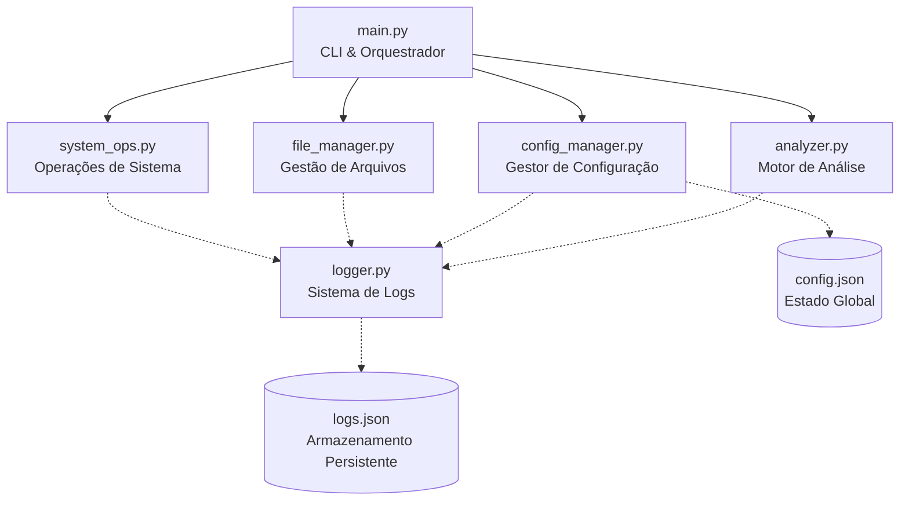

# System Architecture

O projeto **OmniAgent CLI** (anteriormente "Mini-Agente") foi desenhado seguindo princípios de **Clean Architecture** e **Responsabilidade Única (SRP)**, visando modularidade, facilidade de testes e rápida escalabilidade.

## Diagrama da Arquitetura

O sistema é orquestrado através de uma interface de linha de comando baseada em subcomandos (`argparse`), que delega as responsabilidades de negócio para módulos especializados.

## Descrição dos Módulos Principais

### `main.py` (Entry Point / Orquestrador)
Responsável unicamente pelo parsing de argumentos via linha de comando (`argparse`). Ele realiza o roteamento (dispatcher) do comando fornecido pelo usuário para o módulo especialista correspondente, não contendo nenhuma lógica de negócio.

### `logger.py` (Módulo de Telemetria e Logs)
Centraliza a exibição visual de saídas coloridas (`Colorama`) e a persistência de histórico (`logs.json`).
- Implementa diferentes níveis de severidade: `INFO`, `WARNING` e `ERROR`.
- Suporta mecanismo de limitação de cache rotativo (mantendo os últimos X logs) garantindo estabilidade e baixo consumo de disco.

### `file_manager.py` (Gestão de Sistema de Arquivos)
Isola toda interação de I/O de arquivos.
- Funções para listagem, leitura em modo de texto, organização por extensão em subdiretórios lógicos e geração de estatísticas recursivas de pastas.
- Contém lógica para tratamento seguro de cópia de arquivos (evitando overwrites).

### `system_ops.py` (Integração de Sistema Operacional)
Envelopa comandos de shell e manipulação do Sistema Operacional subjacente (Windows / Linux), encapsulando chamadas instáveis do `subprocess.run()`. Retorna ou registra saídas unificadas do standard error (`stderr`) e standard output (`stdout`).

### `analyzer.py` (Motor de Análise de Padrões)
Responsável por fazer varredura em arquivos textos, utilizando regras extraídas dinamicamente, realizando parsing de palavras-chaves críticas. Totalmente desacoplado para no futuro adotar Regex e integrações com Machine Learning.

### `config_manager.py` (Gestão de Estado Global)
Gerencia as preferências do usuário serializadas no arquivo `config.json`. Contém tratamento contra corrupção do disco e auto-recuperação de propriedades críticas para manter a resiliência do CLI.
